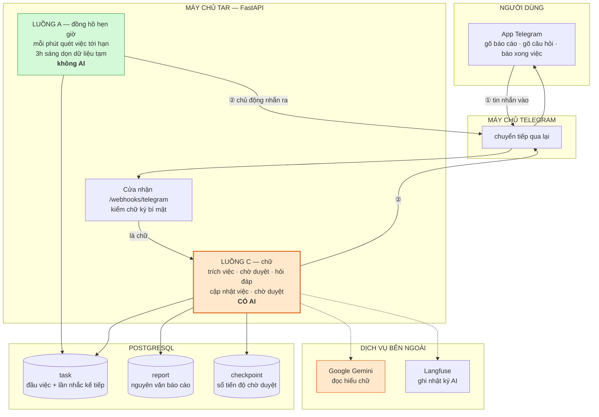
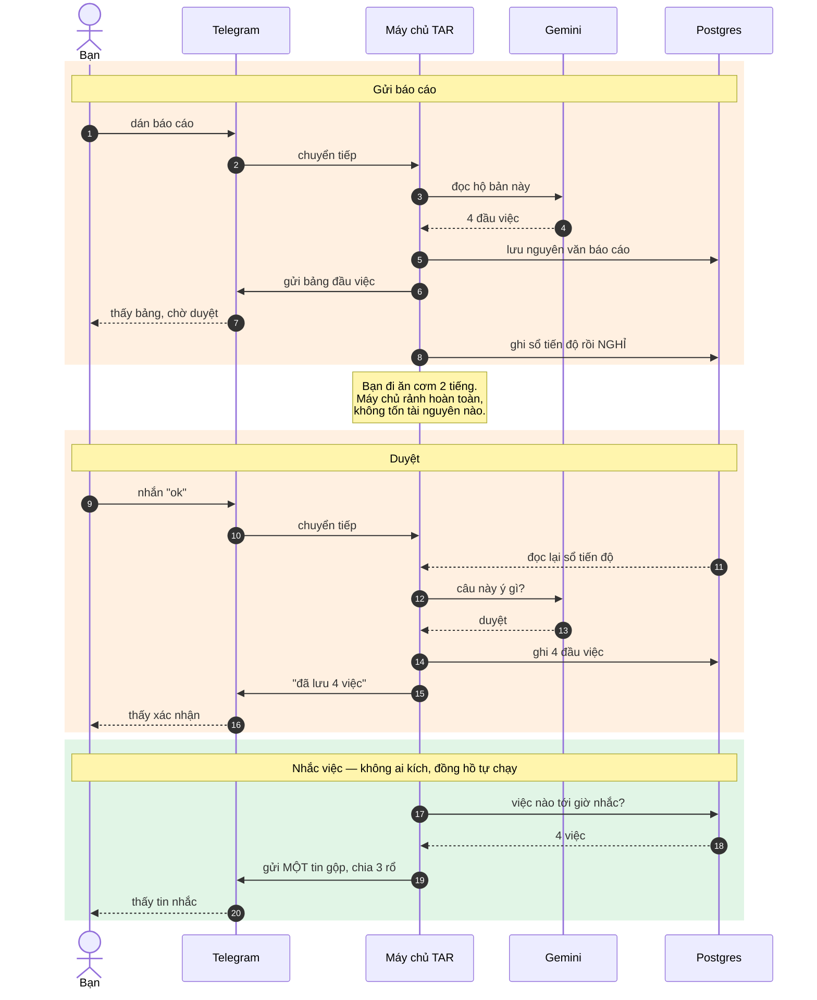
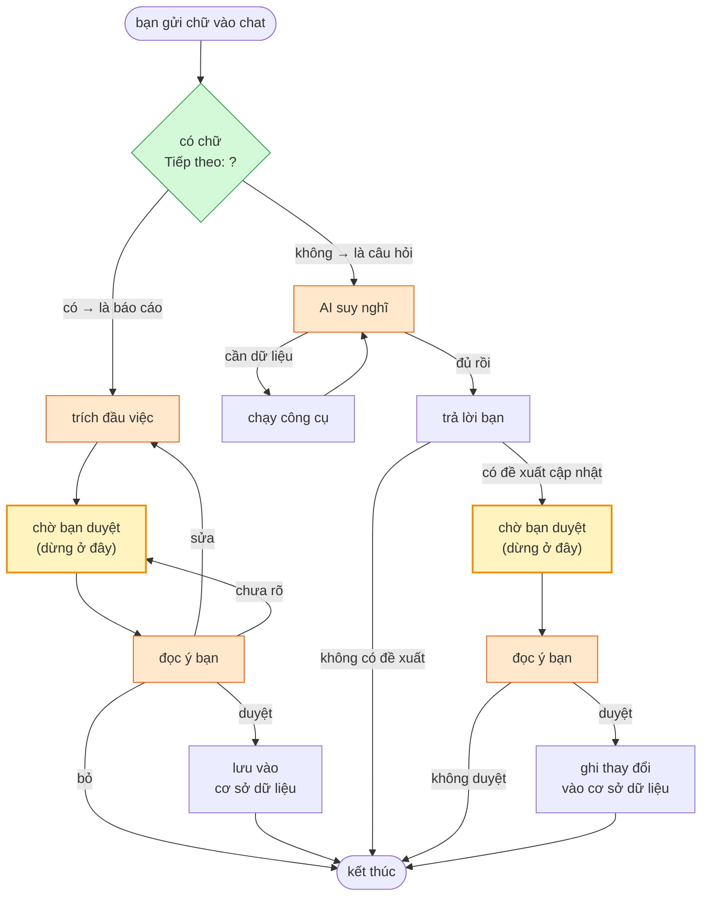
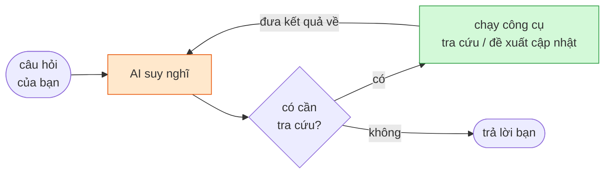

# Bài nói: giới thiệu TAR — Telegram Agent Reminder

> Bản thảo để trình bày. Viết theo lối nói, hạn chế từ chuyên ngành. Chỗ nào
> buộc phải dùng từ kỹ thuật thì có một câu giải nghĩa ngay sau đó.
>
> Thời lượng gợi ý: 12–15 phút. Mục 1 và 4 là phần chính, mục 2 và 3 nói nhanh.

---

## 0. Mở đầu — bài toán

Hằng tuần nhóm dự án gửi một bản báo cáo tiến độ vào nhóm chat. Bản báo cáo có
hai phần: **đã làm được gì** và **sắp tới làm gì**. Phần "sắp tới làm gì" chính
là danh sách việc cần nhớ.

Vấn đề rất đời thường: báo cáo gửi xong thì trôi. Vài hôm sau không ai nhớ hôm
trước đã hứa làm gì, hạn ngày nào. Đến lúc nhớ ra thì đã quá hạn.

**TAR làm đúng một việc:** đọc bản báo cáo đó, tự nhặt ra các đầu việc, rồi chủ
động nhắn nhắc bạn cho tới khi bạn bấm "Đã xong".

Câu chốt để mở bài:

> "Nó giống như một người thư ký đọc hộ bạn bản báo cáo, ghi lại vào sổ, rồi
> ngày nào cũng nhắc bạn — mà không cần bạn phải mở sổ ra xem."

---

## 1. Luồng tổng quát — bức tranh chung

### 1.1. Nói bằng lời

Toàn bộ hệ thống chỉ có **hai việc lớn**, và tôi đặt tên chúng là A, C cho dễ
gọi:

| Tên | Việc gì | Ai kích hoạt |
|---|---|---|
| **A** | Đến giờ thì nhắn nhắc | Đồng hồ hẹn giờ, mỗi phút chạy một lần |
| **C** | Bạn gửi chữ vào chat | Bạn gõ |

Điểm quan trọng cần nhấn mạnh khi trình bày:

> **Chỉ có luồng C dùng đến AI.** Luồng A là code thường, không hỏi AI câu nào.

Vì sao? Vì "đến giờ thì nhắn" là việc có quy tắc rõ ràng, một cái `if` là xong.
Cho AI vào đó chỉ tốn tiền, chậm hơn, và thêm chỗ để sai. AI chỉ được dùng ở chỗ
nó thật sự hơn người: **đọc hiểu một đoạn văn tiếng Việt viết tự do**.

> **Từng có luồng B** lo mấy cái nút "Đã xong / Nhắc sau" gắn dưới tin nhắc. Tôi
> đã bỏ hẳn: một lượt nhắc bây giờ là **một tin gộp cho cả lô việc**, không có
> chỗ gắn nút riêng cho từng việc nữa. Mọi thao tác chuyển sang nhắn tin — mà
> nhắn tin thì đã có sẵn luồng C đọc hiểu.

### 1.2. Sơ đồ tổng

Nhìn từ xa, hệ thống có **bốn khối**: người dùng, máy chủ của tôi, kho dữ liệu,
và hai dịch vụ bên ngoài.



> Sơ đồ này vẽ bằng Mermaid. GitHub và VS Code (bấm `Ctrl+Shift+V`) tự dựng ra
> hình; nếu mở bằng trình soạn thảo thường thì chỉ thấy chữ.

Ba điều nên chỉ vào sơ đồ khi nói:

**① và ② là hai đường khác nhau.** Mũi tên vào và mũi tên ra không phải một —
giải thích ở mục 1.3 ngay dưới.

**Luồng A không có mũi tên nào đi VÀO nó.** Luồng C có mũi tên từ cửa nhận,
riêng A thì không — vì nó do đồng hồ kích chứ không do bạn. Nhưng nó vẫn có mũi
tên đi RA. Đó chính là thứ làm nên bot nhắc việc: bạn không làm gì mà nó vẫn
nhắn.

**Chỉ luồng C mới có mũi tên đi sang Gemini** (hai mũi tên nét đứt màu cam).
Luồng A nằm gọn trong máy chủ và cơ sở dữ liệu. Nhìn sơ đồ là thấy ngay AI chiếm
phần nhỏ tới mức nào.

### 1.2b. Vòng đời một tin nhắn — nhìn theo thời gian

Sơ đồ trên là bố cục. Còn đây là thứ tự thời gian, lấy ví dụ bạn dán một bản báo
cáo rồi duyệt:



Ba điểm nhấn khi nói:

- **Dòng ghi chú ở giữa** — máy chủ không ngồi chờ suốt 2 tiếng, nó ghi sổ rồi
  nghỉ hẳn. Chi tiết ở mục 3.5.
- **Khối cuối màu xanh không có mũi tên nào bắt đầu từ "Bạn"** — đó là luồng A.
- **Cả sơ đồ chỉ có 2 lần gọi Gemini**, còn lại là đọc ghi cơ sở dữ liệu.

### 1.3. Tin nhắn đi và về là hai đường khác nhau

Đây là chỗ hay bị hiểu nhầm, nên nói rõ:

- **Chiều vào:** Telegram gọi sang máy chủ của tôi mỗi khi có tin nhắn mới. Tôi
  chỉ đáp lại đúng một chữ "ok" cho Telegram biết là đã nhận — **cái "ok" này
  không phải câu trả lời cho người dùng**.
- **Chiều ra:** khi muốn nhắn cho bạn, máy chủ của tôi **chủ động gọi ngược
  sang Telegram** để bảo "gửi câu này vào chat X".

Hai chiều độc lập nhau. Nhờ vậy tôi có thể nhắn cho bạn bất cứ lúc nào, kể cả
khi bạn chẳng gửi gì — đó chính là cách luồng A hoạt động.

Câu ví von dùng khi nói:

> "Giống như bạn gọi tổng đài. Tổng đài nói 'vâng em nghe' rồi cúp máy, sau đó
> gọi lại cho bạn để trả lời. Câu 'vâng em nghe' không phải câu trả lời."

### 1.4. Tin nhắn từ điện thoại tới máy chủ bằng cách nào

Nói rõ chỗ này vì từ **webhook** rất hay bị hiểu sai.

**Webhook không phải một dịch vụ trung gian.** Nó chỉ là **một địa chỉ URL nằm
ngay trên máy chủ của tôi**, được dựng sẵn để chờ Telegram gọi vào:

```
POST https://<tên-miền-của-tôi>/webhooks/telegram
```

Nên chỉ có **hai bên** trong câu chuyện này, không có bên thứ ba.

Trình tự đầy đủ khi bạn bấm gửi một tin:

```
1. Bạn gõ "ok" trên app Telegram, bấm gửi
2. App  →  máy chủ Telegram
3. Máy chủ Telegram tra sổ: "bot này khai địa chỉ nhận ở đâu?"
        →  https://abc.railway.app/webhooks/telegram
4. Telegram gọi thẳng vào địa chỉ đó, mang theo nội dung tin nhắn:
        {"message": {"text": "ok", "chat": {"id": 555}}}
5. Máy chủ tôi nhận, xử lý, đáp lại "ok" cho Telegram biết là đã nhận
6. Muốn trả lời bạn thì máy chủ tôi GỌI NGƯỢC sang Telegram (mục 1.3)
```

Bước 3 đáng chú ý: Telegram biết địa chỉ đó vì **lúc khởi động, chương trình của
tôi tự đăng ký nó với Telegram một lần**. Đăng ký xong thì Telegram nhớ mãi.

### 1.5. Hai cách nhận tin — và vì sao phải có cả hai

Cách trên có một điều kiện: máy chủ phải có **tên miền công khai**, để Telegram
gọi vào được. Nhưng lúc phát triển tôi chạy trên máy cá nhân, nằm sau bộ định
tuyến ở nhà — Telegram không có cách nào với tới.

Nên hệ thống có sẵn đường lùi thứ hai:

| | Ai gọi ai | Cần tên miền? | Dùng khi |
|---|---|---|---|
| **Webhook** | Telegram gọi sang tôi | Có | Chạy thật trên máy chủ thuê |
| **Hỏi vòng** | Tôi gọi sang Telegram, vài giây một lần hỏi "có tin mới không?" | Không | Chạy thử trên máy cá nhân |

Điểm hay: **phần xử lý phía sau y hệt nhau**. Dù tin nhắn tới bằng đường nào,
nó cũng dẫn vào cùng một hàm rồi đi tiếp vào luồng C. Chuyển qua lại giữa hai
chế độ chỉ bằng cách điền hay bỏ trống một dòng trong file cấu hình, không phải
sửa một dòng code nào.

---

## 2. Luồng A — đồng hồ nhắc việc

### 2.1. Nó làm gì

Cứ **mỗi phút**, hệ thống tự chạy một lần và hỏi cơ sở dữ liệu đúng một câu:
*"có việc nào đến giờ nhắc chưa?"*. Có thì nhắn, không có thì thôi.

Mỗi việc trong cơ sở dữ liệu đều có một cột ghi **lần nhắc kế tiếp là mấy giờ**.
Nhắc xong thì cột đó được đẩy lên một mốc mới. Cứ thế lặp lại.

### 2.2. Ba quy tắc làm nó "biết điều"

**Quy tắc 1 — cả lô đi trong MỘT tin nhắn.**

Lượt quét thấy 5 việc tới hạn thì gửi **một** tin, không phải 5 tin. Trong tin
đó việc được chia ba rổ, xếp theo thứ tự cần nhìn trước: **quá hạn → ưu tiên →
bình thường**.

Trước kia mỗi việc một tin. Đến lượt quét đông việc là người dùng nhận cả tràng
thông báo, đọc không nổi rồi tắt luôn bot — nhắc nhiều quá thành ra không nhắc
được gì.

Nhịp nhắc chỉ còn **một con số duy nhất** trong file cấu hình
(`PENDING_INTERVAL_MIN`, mặc định 30 phút). Trước đây có bảng bốn nhịp theo mức
ưu tiên, nhưng gộp tin rồi thì cả lô đi cùng một lượt, nhịp riêng từng việc
không còn nghĩa gì.

**Quy tắc 2 — việc thường tự động lên thành việc gấp.**

Có hai trường hợp:
- còn **3 ngày nữa** là tới hạn;
- đã **quá hạn 1 ngày**.

Rơi vào một trong hai thì việc đó tự lên mức gấp. Mức gấp giờ không đổi nhịp
nhắc nữa mà quyết định **việc nằm rổ nào** trong tin gộp — nó nhảy lên đầu tin
nhắn thay vì nằm cuối.

**Quy tắc 3 — không nhắc ngoài giờ làm việc.**

Chỉ nhắc trong khoảng **8h đến 18h**. Việc đến hạn lúc 11h đêm thì không nhắn
lúc đó, mà dời sang 8h sáng hôm sau.

### 2.3. Tin nhắn nhắc trông như thế nào

```
🔔 Bạn có 4 việc cần làm

⛔ QUÁ HẠN (2)
TB-002 · Gửi BCKTKT cho TĐG
    📁 App Trưởng thôn, trưởng bản · 📅 Hạn 19/07 · ⏰ Quá hạn 3 ngày
TB-005 · Quay demo
    📁 App Trưởng thôn, trưởng bản · 📅 Hạn 17/07 · ⏰ Quá hạn 5 ngày

🔴 ƯU TIÊN (1)
BC-001 · Bổ sung quy trình tin học hóa
    📁 Hệ thống báo cáo · 📅 Hạn 24/07 · ⏳ Còn 2 ngày

🔵 BÌNH THƯỜNG (1)
...
```

Không có nút nào. Cái **mã việc ở đầu mỗi dòng** (`TB-002`) mới là cửa vào của
luồng C: bạn gõ lại nó trong tin nhắn để báo xong, hủy, hay đổi hạn.

Mã đó sinh tự động từ tên nhóm — lấy chữ cái đầu của mọi từ rồi giữ hai chữ
cuối: "App **T**rưởng thôn, trưởng **b**ản" → `TB`. Không có danh sách từ đệm
nào phải bảo trì, và mã không đổi kể cả khi tên nhóm sau này đổi, vì nó đã được
in ra cho người dùng rồi.

**Gửi lỗi thì không dời mốc.** Nếu Telegram từ chối tin gộp, hệ thống **không**
đụng vào cột "lần nhắc kế tiếp" của việc nào cả — lượt quét sau gặp lại đúng lô
đó và thử lại. Làm ngược lại thì một lần mạng chập là cả lô im lặng luôn.

---

## 3. Luồng C — bộ não AI, phần chính của đề tài

### 3.1. Trước hết: "agent" và "graph" là gì

Hai từ này sẽ dùng nhiều, nên định nghĩa bằng lời thường:

- **Agent** — chương trình biết tự quyết định làm gì tiếp theo, thay vì chạy
  tuần tự cố định. Ở đây nó tự quyết: *"tin này là báo cáo hay là câu hỏi?"*,
  *"muốn trả lời câu này tôi có phải tra cơ sở dữ liệu không?"*.
- **Graph** — sơ đồ các bước. Mỗi ô vuông là **một việc cần làm** (gọi là
  *node*), mỗi mũi tên là **đi tiếp sang đâu**. Thư viện dùng ở đây là
  **LangGraph**, tên nó nói đúng công dụng: vẽ luồng cho agent bằng sơ đồ.

Vì sao phải vẽ thành sơ đồ mà không viết một mạch từ trên xuống? Vì luồng này có
**vòng lặp** và có **chỗ dừng chờ người**. Viết tuần tự thì hai thứ đó rất rối;
vẽ sơ đồ thì nhìn phát hiểu.

### 3.2. Sơ đồ hai nhánh



Ô màu cam là chỗ có gọi AI, ô vàng là chỗ dừng chờ người, ô xanh là chỗ phân
loại — và nó **không dùng AI**.

**Hai nhánh có cùng một hình dạng ở đoạn cuối**, và đó là chủ ý: cả hai đều kết
thúc bằng *đề xuất → chờ người duyệt → mới ghi*. AI không bao giờ tự tay ghi vào
cơ sở dữ liệu, dù là lưu việc mới hay đóng một việc cũ.

Việc phân loại "báo cáo hay câu hỏi" **không dùng AI**. Chỉ cần tìm xem trong
tin có chữ `"Tiếp theo:"` hay `"Hiện trạng:"` không. Hai chữ này là dấu hiệu
riêng của mẫu báo cáo, chính xác gần như tuyệt đối, mà tốn 0 đồng và 0 mili
giây. Không phải chỗ nào cũng cần AI.

### 3.3. Nhánh báo cáo — bốn bước

Đây là phần đáng nói nhất, nên trình bày kỹ.

**Bước 1 — trích đầu việc.**

Đưa cả bản báo cáo cho AI kèm một bản hướng dẫn (gọi là *prompt*) gồm 5 quy tắc:

1. Chỉ lấy các dòng trong khối **"Tiếp theo:"**. Khối "Hiện trạng:" là việc đã
   làm rồi, bỏ qua hoàn toàn.
2. Tên nhóm dự án lấy từ dòng tiêu đề, bỏ số thứ tự và emoji đi.
3. Dòng nào bắt đầu bằng **"ƯU TIÊN:"** thì đánh dấu là việc gấp.
4. Giữ **nguyên văn** dòng đó, không tóm tắt, không dịch, không viết lại.
5. Hạn trong báo cáo chỉ ghi ngày/tháng như "(hạn 19/7)" — phải tự suy ra năm.
   **Không có hạn thì để trống, tuyệt đối không được bịa.**

Ví dụ đầu vào:

```
2/ 📱 App Trưởng thôn, trưởng bản
📋 Hiện trạng:
• Đã chuẩn hóa actor, transaction
⏩ Tiếp theo:
• Bổ sung quy trình tin học hóa (hạn 19/7)
• ƯU TIÊN: Gửi BCKTKT cho TĐG (hạn 19/7)
```

Kết quả AI trả về:

| Nhóm | Nội dung | Hạn | Mức |
|---|---|---|---|
| App Trưởng thôn, trưởng bản | Bổ sung quy trình tin học hóa (hạn 19/7) | 19/7 | thường |
| App Trưởng thôn, trưởng bản | ƯU TIÊN: Gửi BCKTKT cho TĐG (hạn 19/7) | 19/7 | gấp |

Dòng "Đã chuẩn hóa actor, transaction" bị bỏ đúng như mong muốn.

**Bước 2 — dừng lại chờ bạn duyệt.**

Hệ thống **không tự lưu**. Nó gửi bảng trên vào chat rồi đứng im chờ.

Đây là điểm thiết kế quan trọng nhất, và cũng là câu trả lời cho câu hỏi thường
gặp *"lỡ AI đọc sai thì sao?"*:

> "AI có thể sai, nên tôi không cho nó quyền tự ghi vào cơ sở dữ liệu. Nó chỉ
> được đề xuất, người mới là người duyệt."

**Bước 3 — đọc ý bạn.**

Bảng này **không có nút bấm**. Bạn trả lời bằng tin nhắn thường, viết kiểu gì
cũng được. Ở đây mới cần đến AI lần thứ hai, để phân loại câu trả lời của bạn
vào một trong bốn ý:

| Bạn nhắn | Hiểu thành | Hệ thống làm gì |
|---|---|---|
| "ok", "được rồi", "chuẩn" | **duyệt** | Lưu vào cơ sở dữ liệu |
| "thiếu việc số 3", "sai hạn dòng 2" | **sửa** | Quay lại bước 1, trích lại kèm yêu cầu sửa |
| "thôi bỏ đi" | **bỏ** | Huỷ, không lưu gì |
| "hehe", "ừm" | **chưa rõ** | Hỏi lại, bảng vẫn treo chờ |

Vì sao không làm nút bấm cho nhanh? Vì nút chỉ có Có/Không, còn câu *"bỏ việc số
3 đi, việc 1 hạn phải là 20 chứ không phải 19"* thì không nút nào diễn đạt nổi.
Cho gõ tự do thì linh hoạt hơn hẳn — đổi lại phải tốn thêm một lần hỏi AI.

**Bước 4 — lưu vào cơ sở dữ liệu.**

Mỗi việc được cấp một mã riêng, tính bằng cách **băm** (biến một chuỗi chữ thành
một mã ngắn cố định) từ *tên nhóm + nội dung việc*. Điểm tinh tế: **phần "(hạn
19/7)" bị cắt bỏ trước khi băm**.

Lý do: hạn là **thuộc tính** của công việc, không phải **căn cước** của nó. Nếu
băm cả hạn thì tuần sau bạn gửi lại báo cáo đã sửa hạn thành 20/7, hệ thống sẽ
coi đó là một việc hoàn toàn mới → trong cơ sở dữ liệu có hai dòng cùng một
việc, và dòng cũ vẫn nhắc theo hạn đã lỗi thời. Cắt hạn ra thì gửi lại bao nhiêu
lần cũng chỉ cập nhật đúng một dòng.

### 3.4. Nhánh hỏi đáp — và các công cụ

Nhánh này để bạn hỏi lại những gì đã lưu, bằng tiếng Việt tự nhiên:

- *"20/7 tôi có việc gì không?"*
- *"nhóm App Trưởng thôn còn việc nào chưa xong?"*
- *"việc gửi BCKTKT hạn thứ mấy?"*

**Vấn đề:** AI ngôn ngữ không biết gì về cơ sở dữ liệu của tôi. Nó chỉ giỏi chữ
nghĩa, không có sẵn dữ liệu.

**Cách giải:** cho nó **công cụ** (*tool*). Hiểu đơn giản: tôi viết sẵn vài hàm,
rồi mô tả cho AI biết *"anh có mấy cái nút này, cần thì cứ bấm"*. AI không tự
chạy được — nó chỉ nói ra *"tôi muốn dùng công cụ số 1 với điều kiện ngày 20/7"*,
còn chương trình của tôi mới thật sự chạy hàm đó rồi đưa kết quả lại cho AI đọc.

**Ba công cụ hiện có:**

| Công cụ | Dùng để | Lọc được theo |
|---|---|---|
| `query_tasks` | Tra danh sách đầu việc | nhóm dự án, trạng thái (chưa xong / đã xong / đã hủy), mức ưu tiên, khoảng hạn từ ngày → đến ngày |
| `search_reports` | Đọc lại nguyên văn báo cáo cũ | khoảng thời gian nhận, nhóm dự án |
| `propose_task_update` | **Đề xuất** đóng việc / hủy việc / đổi hạn | mã việc `TB-002`, hoặc một phần nội dung |

Hai công cụ đầu **chỉ đọc**. Công cụ thứ ba nghe như được ghi, nhưng không: nó
tra ra đúng dòng việc rồi trả về một *đề xuất*, và dừng ở đó. Việc ghi nằm ở ô
`ghi thay đổi` trong sơ đồ — chỉ chạy sau khi bạn gật.

Ba khả năng khi tra:

| Tìm thấy | Công cụ trả về | AI làm gì |
|---|---|---|
| không việc nào | `not_found` | báo không tìm thấy, hỏi lại mã |
| nhiều việc khớp | `ambiguous` + danh sách | đọc mã từng ứng viên, hỏi bạn chọn |
| đúng một việc | `proposed` | nói sẽ làm gì, rồi hệ thống hỏi duyệt |

**Đây là chỗ mã việc phát huy tác dụng.** Bạn nhắn "việc viết tài liệu xong rồi"
mà có ba việc chứa chữ đó thì AI **không được đoán** — nó liệt kê ba mã ra và
hỏi lại. Còn nhắn thẳng "TB-002 xong rồi" thì ra đúng một dòng, không phải hỏi.

**Một mẹo nhỏ đáng khoe:** khi trả kết quả, chương trình tính sẵn "thứ mấy" và
"còn mấy ngày" rồi đưa kèm, thay vì để AI tự suy từ ngày tháng. Vì AI tính lịch
rất hay sai — hỏi "19/7/2026 là thứ mấy" thì nó đoán, còn Python tính thì chắc
chắn đúng. **Việc gì máy tính làm chắc thì đừng giao cho AI.**

Vòng chạy của nhánh này:



Vòng này bị chặn tối đa **3 lượt** để phòng trường hợp AI tra đi tra lại không
dứt.

### 3.5. Chỗ dừng chờ người — giải thích cho kỹ

Nếu ban giám khảo hỏi sâu, đây là chỗ nên nói:

Khi hệ thống "dừng chờ bạn duyệt", nó **không hề có tiến trình nào ngồi chờ**.
Toàn bộ tiến độ được ghi xuống cơ sở dữ liệu rồi chương trình thoát hẳn.

Cụ thể: mỗi khung chat có một "sổ tiến độ" riêng, ghi hai thứ — *bảng đầu việc
đã trích* và *đang dừng ở bước nào*. Khi bạn nhắn "ok" vào ngày hôm sau, chương
trình đọc lại sổ đó, dựng lại đúng trạng thái cũ rồi chạy tiếp.

Lợi ích thực tế:
- Chờ 2 tiếng hay 2 ngày cũng không tốn tài nguyên gì.
- Máy chủ khởi động lại giữa chừng cũng không mất bảng đầu việc.
- Nhiều người dùng chờ cùng lúc cũng không sao, mỗi khung chat một sổ riêng.

Đổi lại có một cái bẫy mà tôi mất khá lâu mới hiểu: **bước "chờ duyệt" bị chạy
lại từ đầu mỗi lần bạn trả lời**. Nên bước đó phải để rỗng, tuyệt đối không đặt
việc gửi tin nhắn hay gọi AI vào trong. Đặt nhầm thì cứ mỗi câu bạn trả lời, bot
lại gửi lặp lại bảng cũ và tốn thêm một lần gọi AI. Đó chính là lý do bước "chờ
duyệt" và bước "đọc ý bạn" được tách thành **hai bước riêng** thay vì gộp một.

Có **hai** chỗ dừng như vậy — một cho bảng đầu việc, một cho đề xuất cập nhật —
nên khi tin nhắn của bạn tới, hệ thống phải hỏi sổ tiến độ *"đang treo ở chỗ nào
không?"* và liệt kê đủ cả hai. Sót một cái là câu "ok" của bạn bị đem đi phân
loại như một câu hỏi mới, còn đề xuất thì treo mãi không ai duyệt.

Hai chỗ dừng đó cố ý xử lý câu trả lời khó hiểu theo **hai kiểu khác nhau**:

| | Trả lời chưa rõ thì |
|---|---|
| Bảng đầu việc | hỏi lại, bảng vẫn treo chờ |
| Đề xuất cập nhật | **bỏ luôn đề xuất** |

Lý do: trích lại một bảng đầu việc tốn một lần gọi AI, còn dựng lại một đề xuất
chỉ tốn đúng một câu bạn nhắn. Treo ở chỗ dừng thì nuốt mọi tin nhắn sau đó của
bạn, nên với thứ rẻ tiền như đề xuất thì thà bỏ đi cho nhẹ.

---

## 4. Tổng kết chức năng

### 4.1. Bảng chức năng

| Nhóm | Chức năng |
|---|---|
| **Nhập liệu** | Dán báo cáo tiếng Việt → tự trích đầu việc |
| | Tự nhận diện việc gấp qua tiền tố "ƯU TIÊN:" |
| | Tự suy ra năm cho hạn chỉ ghi ngày/tháng |
| | Không có hạn thì hỏi lại, không tự bịa |
| | Gửi lại báo cáo đã sửa thì cập nhật, không tạo bản trùng |
| **Duyệt** | Hiện bảng chờ người duyệt trước khi lưu |
| | Trả lời bằng lời tự do: duyệt / sửa / bỏ |
| | Yêu cầu sửa thì trích lại theo đúng ý |
| | Trả lời chưa rõ thì hỏi lại, không tự quyết |
| | Hiểu hạn nói kiểu "2 ngày nữa", "1 tháng nữa" thành ngày cụ thể |
| **Nhắc việc** | Gộp cả lô việc tới hạn vào **một** tin duy nhất |
| | Chia ba rổ: quá hạn → ưu tiên → bình thường |
| | Tự nâng mức khi sắp tới hạn hoặc đã quá hạn |
| | Chỉ nhắc trong giờ làm việc |
| | Mỗi việc có mã ngắn `TB-002` để gõ lại trong tin nhắn |
| **Cập nhật việc** | Nhắn "TB-002 xong rồi" → đánh dấu hoàn thành |
| | Nhắn "hủy việc quay demo" → bỏ việc, không xoá khỏi dữ liệu |
| | Nhắn "dời TB-003 sang 2 tuần nữa" → đổi hạn, lịch nhắc chạy theo hạn mới |
| | Nói mơ hồ thì liệt kê ứng viên hỏi lại, không đoán |
| | Mọi thay đổi đều hỏi duyệt trước, và xác nhận lại sau khi ghi |
| | Việc đã xong hoặc đã hủy thì thôi không nhắc nữa |
| | Hoàn tác trong 24 giờ |
| **Hỏi đáp** | Hỏi bằng tiếng Việt về việc đã lưu |
| | Tra theo nhóm, trạng thái, mức ưu tiên, khoảng hạn |
| | Đọc lại nguyên văn báo cáo cũ |
| | Nhớ ngữ cảnh vài lượt hội thoại gần nhất |
| **Vận hành** | Chạy được cả chế độ webhook (khi có tên miền) lẫn chế độ tự hỏi Telegram (khi chạy máy cá nhân) |
| | Kiểm tra chữ ký bí mật để chặn người lạ gọi vào |
| | Gửi tin lỗi thì tự thử lại |
| | Tự dọn dữ liệu tạm cũ lúc 3h sáng |
| | Xem lại toàn bộ quá trình AI suy nghĩ trên Langfuse |
| | Sửa hướng dẫn cho AI trên giao diện web, không cần sửa code |

### 4.2. Công nghệ dùng — và vì sao chọn

| Thành phần | Chọn cái gì | Vì sao |
|---|---|---|
| Giao diện người dùng | **Telegram** | Không phải làm app, ai cũng có sẵn, lại có sẵn thông báo đẩy |
| Máy chủ web | **FastAPI** | Nhẹ, viết kiểu bất đồng bộ nên chờ AI trả lời không làm nghẽn người khác |
| Luồng cho AI | **LangGraph** | Là thư viện hiếm hoi làm được chỗ "dừng chờ người duyệt" |
| Mô hình AI | **Google Gemini** | Đọc tiếng Việt tốt, có bậc miễn phí |
| Cơ sở dữ liệu | **PostgreSQL** | Lưu cả việc, cả báo cáo gốc, cả sổ tiến độ trong một chỗ |
| Hẹn giờ | **APScheduler** | Đủ dùng cho một tác vụ mỗi phút, không cần dựng thêm dịch vụ |
| Theo dõi AI | **Langfuse** | Xem lại từng câu đã hỏi AI, AI trả gì, tốn bao nhiêu |

### 4.3. Ba điều tâm đắc — dùng để chốt bài

**Một là: dùng AI đúng chỗ.**

Hệ thống chỉ gọi AI ở ba loại việc: trích đầu việc, đọc ý người duyệt, trả lời
câu hỏi. Mọi thứ còn lại — phân loại tin nhắn, tính nhịp nhắc, tính thứ trong
tuần, chia rổ tin nhắc, sinh mã việc — đều là code thường. Chỗ nào có quy tắc rõ
thì viết quy tắc, đừng hỏi AI.

**Hai là: không cho AI quyền ghi.**

AI chỉ được đề xuất, người duyệt mới được lưu — kể cả khi đóng một việc cũ chứ
không riêng lúc lưu việc mới. Cả ba công cụ đều không được ghi: hai cái đầu chỉ
đọc, cái thứ ba dừng ở mức đề xuất. Nhờ vậy AI có sai thì hậu quả tệ nhất cũng
chỉ là bạn phải gõ "thôi".

**Ba là: thiết kế cho việc chờ lâu.**

Người dùng có thể duyệt sau hai ngày, máy chủ có thể khởi động lại giữa chừng.
Toàn bộ tiến độ nằm dưới cơ sở dữ liệu chứ không nằm trong bộ nhớ, nên hai
chuyện đó đều không làm hỏng gì.

---

## 5. Phòng khi bị hỏi

**"Lỡ AI trích sai thì sao?"**
> Không sao, vì nó không được tự lưu. Bảng luôn hiện ra chờ duyệt, sai thì tôi
> nhắn lại chỗ cần sửa và nó trích lại.

**"Sao không dùng nút bấm cho khâu duyệt, đỡ tốn một lần gọi AI?"**
> Nút chỉ diễn đạt được Có/Không. Còn "bỏ việc 3, việc 1 hạn phải là 20 chứ
> không phải 19" thì không nút nào làm được. Tôi chọn linh hoạt và chấp nhận
> tốn thêm.

**"Trước có nút Đã xong / Nhắc sau dưới tin nhắc, sao lại bỏ?"**
> Vì tin nhắc giờ gộp cả lô việc vào một tin. Một tin thì gắn được bộ nút nào
> cho việc nào? Bỏ nút đi, thay bằng mã việc in ngay trong tin — bạn gõ
> "TB-002 xong rồi" là được, mà lại nói được cả những thứ nút không diễn đạt
> nổi như "dời sang 2 tuần nữa".

**"Sao không cho AI viết thẳng câu lệnh truy vấn cơ sở dữ liệu?"**
> Vì như thế là trao quyền ghi và xoá cho AI. Tôi cố định sẵn mấy hàm, AI chỉ
> được chọn điều kiện lọc chứ không được tự viết câu lệnh — và không hàm nào
> trong tay AI được phép ghi.

**"Hủy việc thì sao không xoá luôn khỏi cơ sở dữ liệu?"**
> Hai lý do. Một, hủy nhầm thì còn khôi phục được. Hai, nếu xoá hẳn thì lần sau
> gửi lại đúng bản báo cáo cũ, việc đã hủy sẽ sống dậy — vì hệ thống không còn
> dấu vết nào để biết bạn từng bỏ nó.

**"Webhook là gì, có phải một dịch vụ trung gian không?"**
> Không. Nó chỉ là một địa chỉ URL nằm ngay trên máy chủ của tôi, dựng sẵn để
> chờ Telegram gọi vào. Cả câu chuyện chỉ có hai bên: Telegram và máy chủ tôi.

**"Không có tên miền thì bot chạy được không?"**
> Được. Không khai tên miền thì chương trình tự chuyển sang chế độ hỏi vòng —
> tôi chủ động gọi sang Telegram vài giây một lần để hỏi có tin mới không. Phần
> xử lý phía sau không đổi gì cả.

**"Người lạ biết địa chỉ đó rồi gọi bừa vào thì sao?"**
> Lúc đăng ký với Telegram tôi kèm theo một chuỗi bí mật. Mỗi lần gọi vào,
> Telegram phải gửi lại đúng chuỗi đó; không khớp thì máy chủ từ chối ngay,
> chưa kịp xử lý gì.

**"Nhiều người dùng cùng lúc có được không?"**
> Được. Mỗi khung chat có sổ tiến độ riêng, tách theo mã khung chat. Người này
> đang chờ duyệt không ảnh hưởng người kia.

**"Sao AI hay đoán sai năm của hạn?"**
> Vì báo cáo chỉ ghi "19/7". Tôi xử lý bằng cách đưa ngày hôm nay vào bản hướng
> dẫn và ghi rõ quy tắc chọn năm — kèm dặn thêm rằng **hạn đã qua là chuyện bình
> thường**, đừng thấy quá hạn mà đẩy sang năm sau, vì báo cáo tiến độ vốn hay
> nói về việc đang trễ.

**"Chi phí chạy thật khoảng bao nhiêu?"**
> Mỗi bản báo cáo tốn hai lần gọi AI (trích + đọc ý duyệt), mỗi câu hỏi tốn một
> đến vài lần. Luồng nhắc việc chạy suốt ngày đêm nhưng không gọi AI lần nào,
> nên phần tốn nhất lại là phần chạy ít nhất.

---

## 6. Kịch bản demo

Trình bày theo đúng thứ tự này thì chạm được cả hai luồng và cả hai chỗ dừng
chờ duyệt:

1. **Dán một bản báo cáo** → bot hiện bảng đầu việc *(luồng C, nhánh báo cáo)*
2. **Nhắn "bỏ việc số 2 đi"** → bot trích lại, bảng mới thiếu việc 2 *(vòng sửa)*
3. **Nhắn "ok"** → bot báo đã lưu *(duyệt và ghi)*
4. **Chờ tới mốc nhắc** → **một** tin gộp hiện ra, chia ba rổ, mỗi dòng có mã
   việc *(luồng A)*
5. **Nhắn "TB-002 xong rồi"** → bot đề xuất, nhắn "ok" → bot xác nhận đã ghi
   *(luồng C, chỗ dừng thứ hai)*
6. **Nhắn "dời TB-003 sang 2 tuần nữa"** → bot nhắn lại đúng ngày cụ thể kèm thứ
   để soát trước khi gật *(hạn tương đối)*
7. **Chờ lượt nhắc kế** → hai việc vừa xử lý **không** còn xuất hiện
8. **Hỏi "tuần này tôi còn việc gì?"** → bot tra cơ sở dữ liệu rồi trả lời
   *(luồng C, nhánh hỏi đáp)*
9. **Mở Langfuse** → chỉ ra từng bước AI vừa chạy, câu hỏi và câu trả lời đầy đủ

Mẹo khi demo: đặt tạm `PENDING_INTERVAL_MIN` xuống **1 phút** để bước 4 và bước
7 không phải chờ lâu trước mặt mọi người.
