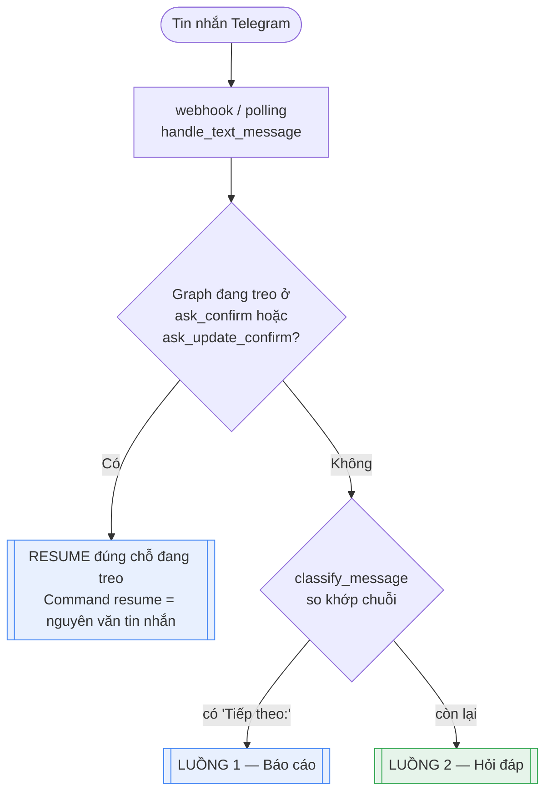
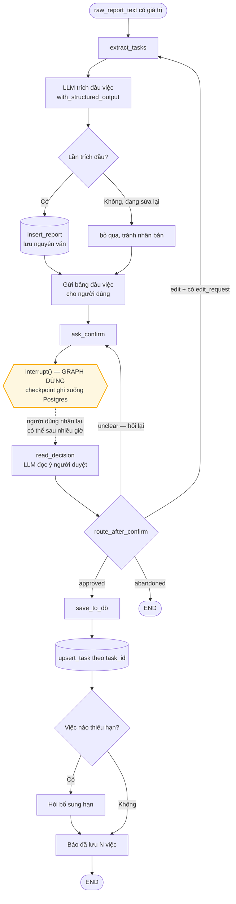
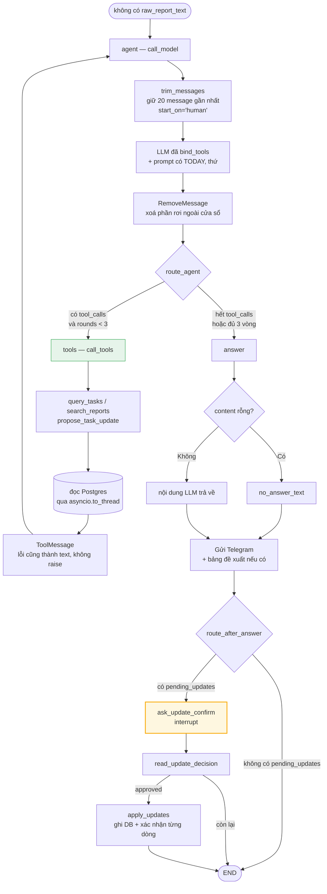

# Hai luồng xử lý của Reminder Agent (Job C)

Job C là phần duy nhất trong TAR dùng LLM. Nó là một `StateGraph` của LangGraph
với **hai nhánh tách rời hoàn toàn** — không nhánh nào gọi sang nhánh kia:

| | Luồng 1 — Báo cáo | Luồng 2 — Hỏi đáp |
|---|---|---|
| Kích hoạt bởi | Tin nhắn có `Tiếp theo:` / `Hiện trạng:` | Mọi tin nhắn còn lại |
| Việc chính | Trích đầu việc rồi ghi vào DB | Tra cứu dữ liệu rồi trả lời |
| Có tool không | Không | Có (3 tool) |
| Có dừng chờ người không | **Có** — `interrupt()` | **Có** — `interrupt()`, chỉ khi có đề xuất |
| Ghi dữ liệu | Có (`report`, `task`) | Có (`task`), nhưng chỉ sau khi người dùng duyệt |
| Số lần gọi LLM | 1 mỗi lượt trích + 1 mỗi lượt đọc ý người duyệt | 1–4 (kể cả vòng gọi tool), +1 nếu có đề xuất phải duyệt |
| Node | `extract_tasks`, `ask_confirm`, `read_decision`, `save_to_db` | `agent`, `tools`, `answer`, `ask_update_confirm`, `read_update_decision`, `apply_updates` |

Hai nhánh giống nhau ở đoạn cuối vì cùng một nguyên tắc: **LLM chỉ đề xuất, code
chỉ ghi sau khi người dùng gật**. Nhánh 2 mọc thêm cái đuôi đó khi có tool
`propose_task_update` — tool không được ghi, nên phần ghi phải nằm ở node riêng
sau `interrupt()`.

Mã nguồn: [`reminder_agent/graph.py`](../reminder_agent/graph.py)

---

## Điểm vào chung

Trước khi vào graph, tin nhắn đi qua một bộ phân loại **không dùng LLM** nằm ở
[`reminder_agent/utils/intent.py`](../reminder_agent/utils/intent.py):

```python
_REPORT_MARKERS = ("tiếp theo:", "hiện trạng:")

def classify_message(text) -> Literal["report", "question"]:
    return "report" if any(m in text.lower() for m in _REPORT_MARKERS) else "question"
```

Chỉ so khớp chuỗi. Cố ý không dùng LLM: phân loại sai ở bước này thì cả lượt
chạy đi sai nhánh, mà so khớp chuỗi thì luôn đoán trước được kết quả và không
tốn một lời gọi API nào.



Thứ tự kiểm tra rất quan trọng: **luôn hỏi "có đang treo không" trước**. Người
dùng gõ "ok" khi đang chờ duyệt là câu trả lời cho thứ đang treo, không phải câu
hỏi mới — kiểm tra ngược lại sẽ đẩy "ok" vào nhánh hỏi đáp.

Điểm vào graph ([`route_entry`](../reminder_agent/graph.py)) chỉ nhìn một trường:

```python
def route_entry(self, state):
    return "report" if state.get("raw_report_text") else "qa"

builder.add_conditional_edges(
    START, self.route_entry, {"report": "extract_tasks", "qa": "agent"}
)
```

---

## Luồng 1 — Báo cáo



### Bốn node

**1. `extract_tasks`** — gọi LLM với `ExtractionResult` làm schema bắt buộc, nên
kết quả luôn đúng hình dạng, không phải parse chuỗi. Prompt được bơm `{{TODAY}}`
để LLM suy ra năm cho những chuỗi kiểu `(hạn 19/7)` — thiếu nó thì nó tự bịa năm.

Hai chi tiết dễ sai nếu viết lại:

- `insert_report` **chỉ chạy ở lần trích đầu**. Nhánh sửa quay lại đúng node này,
  lưu tiếp là nhân bản cùng một báo cáo trong DB.
- Bảng đầu việc gửi ở đây, **không** gửi trong `ask_confirm`. Node có `interrupt()`
  chạy lại từ đầu mỗi lần resume, đặt `send_message` trong đó thì người dùng nhận
  lại bảng cũ sau mỗi câu trả lời.

**2. `ask_confirm`** — chốt chặn người duyệt, và **không làm gì khác**:

```python
reply = interrupt({"awaiting": "confirm", "tasks": state.get("extracted_tasks", [])})
return {"confirm_reply": reply}
```

`interrupt()` **dừng hẳn** graph, ghi toàn bộ state xuống checkpoint Postgres rồi
trả quyền điều khiển về. Tiến trình có thể restart, hôm sau người dùng trả lời
thì graph chạy tiếp đúng chỗ cũ — trạng thái nằm ở DB chứ không nằm trong RAM.

Node này trống rỗng là **có chủ đích**: nó chạy lại từ đầu mỗi lần resume, nên
mọi side effect đặt vào đây đều lặp lại một lần cho mỗi câu trả lời.

**3. `read_decision`** — đọc nguyên văn câu trả lời thành ý định.

Bảng đầu việc **không có nút bấm**. Người dùng trả lời tự do, và một LLM riêng
(`decision`, xem `decision_system.md`) đọc ý định thành `approved` / `edit` /
`abandoned` / `unclear`.

Tách khỏi `ask_confirm` vì hai lý do: (a) node thường chạy đúng một lần nên
không tốn lời gọi LLM thừa, (b) nằm trong graph nên callback Langfuse gắn ở tầng
graph phủ được — hồi còn xử lý ở webhook thì lượt gọi này vô hình trên trace.

**4. `save_to_db`** — `upsert_task` theo `task_id = sha256(nhóm + nội dung)[:16]`
(R7), nên gửi lại cùng một báo cáo không tạo bản trùng. Việc nào không có hạn thì
hỏi bổ sung đúng một lần (R9).

### Vòng sửa và vòng hỏi lại

`route_after_confirm` đọc `confirm_status` rồi rẽ ba hướng khác `END`:

| status | đi đâu | vì sao |
|---|---|---|
| `approved` | `save_to_db` | duyệt xong, lưu |
| `edit` | `extract_tasks` | trích lại, kèm `edit_request` nối vào `extract_retry.md` |
| `unclear` | `ask_confirm` | hỏi lại, bảng vẫn đang chờ duyệt |

Người dùng chỉ tỏ ý không ưng mà chưa nói sửa chỗ nào (`edit` nhưng
`edit_request = null`) thì `read_decision` **hạ xuống `unclear`** — trích lại mà
không biết sửa gì thì chỉ ra đúng kết quả cũ, tốn một lời gọi LLM vô ích.

Hướng `unclear -> ask_confirm` là chỗ vòng lặp khép lại: graph treo lại ở
`interrupt()`, `_is_awaiting_confirm` ở webhook vẫn thấy `ask_confirm` trong
`snapshot.next`, nên câu trả lời kế tiếp lại đi đúng đường này.

---

## Luồng 2 — Hỏi đáp



### Ba tool

Khai trong [`utils/tools/`](../reminder_agent/utils/tools/):

| Tool | Trả về |
|---|---|
| `query_tasks` | Lọc theo nhóm / trạng thái / mức ưu tiên / khoảng hạn |
| `search_reports` | Báo cáo cũ theo khoảng ngày, nguyên văn |
| `propose_task_update` | `not_found` / `ambiguous` + ứng viên / `proposed` / `invalid_due_date` |

**Không tool nào được ghi DB.** Hai cái đầu hiển nhiên chỉ đọc; cái thứ ba tra ra
đúng dòng việc rồi dừng ở mức *đề xuất*. Nơi ghi duy nhất của nhánh này là node
`apply_updates`, và nó chỉ chạy sau `interrupt()`.

**Docstring của tool chính là prompt của nó.** Decorator `@tool` lấy nguyên
docstring làm `description` gửi cho Gemini, và lấy type hint làm JSON schema tham
số. Sửa docstring = sửa prompt, phải khởi động lại tiến trình.

Model không thấy code, không thấy SQL. Nó chỉ thấy tên + mô tả + hình dạng tham
số rồi tự quyết định gọi hay không.

`query_tasks` trả kèm những trường **đã tính sẵn bằng Python** — `due_weekday`,
`days_left` — thay vì để LLM tự suy từ ngày ISO. Tính lịch là thứ LLM sai thường
xuyên, mà sai kiểu đó thì trông vẫn rất thật.

### Ba chốt chặn

| Chốt | Ở đâu | Chống điều gì |
|---|---|---|
| `max_tool_rounds = 3` | `route_agent` | Vòng lặp `agent ↔ tools` chạy mãi |
| `no_answer_text()` | `answer` | Hết vòng mà vẫn còn `tool_calls` → `content` rỗng → bot im lặng như đã chết |
| `start_on="human"` | `_recent_history` | Cắt lịch sử làm mồ côi cặp `tool_calls` ↔ `ToolMessage`, Gemini trả lỗi 400 |

`max_tool_rounds` đếm theo **lượt vào node `tools`**, không phải số tool được
gọi: một lượt gọi 2 tool vẫn tính 1.

`RemoveMessage` ở cuối `call_model` là thứ dễ bỏ sót. Chỉ cắt lúc gửi thì chưa
đủ — LangGraph vẫn ghi nguyên list vào checkpoint mỗi lượt, mà `thread_id` không
bao giờ đổi (mỗi chat một thread), nên lịch sử phình vô hạn.

---

## State dùng chung

Cả hai luồng chia sẻ một `GraphState`
([`utils/state.py`](../reminder_agent/utils/state.py)), nhưng mỗi luồng chỉ đụng
phần của mình:

| Trường | Luồng 1 | Luồng 2 |
|---|:---:|:---:|
| `chat_id` | ✅ | ✅ |
| `raw_report_text` | ✅ | — (phải là `None`) |
| `extracted_tasks` | ✅ | — |
| `edit_request` | ✅ | — |
| `confirm_status` | ✅ | — |
| `messages` | — | ✅ |
| `tool_call_rounds` | — | ✅ |
| `pending_updates` | — | ✅ |
| `update_status` | — | ✅ |
| `awaiting_due_task_ids` | ✅ ghi | ✅ đọc |

`raw_report_text` vừa là dữ liệu vừa là công tắc rẽ nhánh: có giá trị thì vào
luồng 1, `None` thì vào luồng 2.

`awaiting_due_task_ids` là trường **duy nhất bắc cầu giữa hai luồng**:
`save_to_db` ghi vào đó `task_id` của mọi việc chưa có hạn vừa hỏi, còn
`call_model` đọc ra để nối một dòng ngữ cảnh vào system prompt — nếu không thì
câu trả lời "3 ngày nữa" rơi vào luồng 2 mà LLM chẳng biết nó nói về việc nào.
Danh sách tự cạn: việc nào đã có hạn thì bị lọc ra và không quay lại.

Hai trường phải **reset tường minh ở mỗi lượt mới** tại
[`webhooks.py`](../app/routers/webhooks.py): `raw_report_text` và
`pending_updates`. Giá trị cũ còn nằm trong checkpoint thì lượt sau vừa trả lời
xong đã hỏi duyệt một đề xuất người dùng không hề nhắc tới.

## Checkpointer — chỗ hai luồng gặp nhau

Cả hai dùng chung `AsyncPostgresSaver` với `thread_id = str(chat_id)`, dựng trong
`lifespan` của FastAPI ([`app/main.py`](../app/main.py)). Hệ quả:

- **Một chat = một thread duy nhất**, lịch sử hội thoại liên tục qua các lần
  restart.
- Cả hai chỗ `interrupt()` dừng được là nhờ checkpointer này. Không có nó thì mất
  tiến trình là mất luôn bảng đang chờ duyệt.
- Checkpoint cũ hơn `CHECKPOINT_RETENTION_DAYS` (mặc định 14) bị dọn lúc 3h sáng.

## Hai chỗ `interrupt()`, hai cách xử "chưa rõ"

Từ khi luồng 2 có đuôi duyệt riêng, graph có **hai** node chứa `interrupt()`.
`_is_awaiting_confirm` ở [`webhooks.py`](../app/routers/webhooks.py) phải kiểm cả
tập `{"ask_confirm", "ask_update_confirm"}` — sót một cái là câu "ok" của người
dùng bị `classify_message` coi như câu hỏi mới, còn graph treo mãi ở `interrupt()`.

Hai chỗ cố ý xử lý `unclear` **khác nhau**:

| | `unclear` thì |
|---|---|
| `read_decision` (bảng đầu việc) | quay lại `ask_confirm`, bảng vẫn treo chờ |
| `read_update_decision` (đề xuất) | **bỏ đề xuất**, về `END` |

Trích lại một bảng đầu việc tốn một lời gọi LLM, còn dựng lại một đề xuất chỉ tốn
một câu người dùng nhắn. Mà treo ở `interrupt()` thì nuốt mọi tin nhắn sau đó của
họ — với thứ rẻ như đề xuất thì bỏ đi lợi hơn giữ.

Cùng lý do đó, `read_update_decision` gộp luôn `edit` vào `abandoned`: đề xuất
chỉ có ok hoặc thôi, muốn đổi thì nhắn lại từ đầu.

---

## Đối chiếu nhanh với Job A

Để khỏi lẫn: hai luồng nói trên **đều nằm trong Job C**. Job còn lại không đụng
gì tới LLM hay graph.

| | Vào bằng đâu | LLM | Graph |
|---|---|:---:|:---:|
| **Job A** — quét việc tới hạn, gửi một tin nhắc gộp | APScheduler, mỗi phút | ❌ | ❌ |
| **Job C** — 2 luồng ở tài liệu này | tin nhắn text | ✅ | ✅ |

> Job B (nút Đã xong / Nhắc sau / Hoàn tác) đã bị xoá hẳn: tin nhắc gộp cả lô nên
> không gắn nút cho từng việc được nữa. Mọi thao tác đó giờ nằm ở đuôi duyệt của
> luồng 2.
