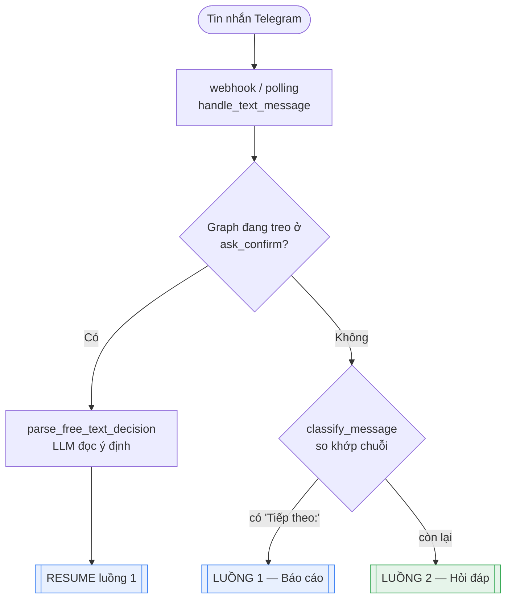
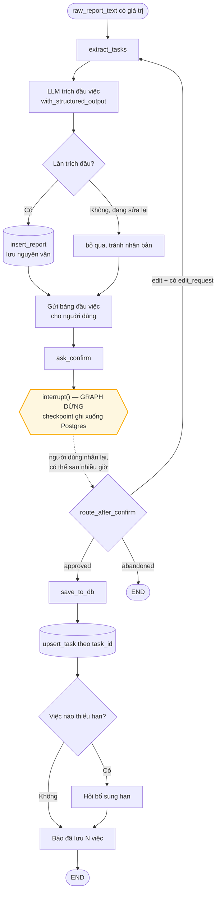
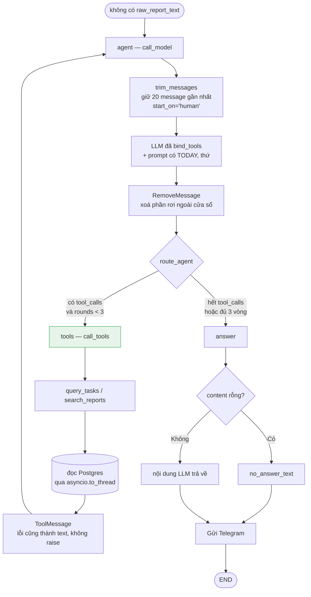

# Hai luồng xử lý của Reminder Agent (Job C)

Job C là phần duy nhất trong TAR dùng LLM. Nó là một `StateGraph` của LangGraph
với **hai nhánh tách rời hoàn toàn** — không nhánh nào gọi sang nhánh kia:

| | Luồng 1 — Báo cáo | Luồng 2 — Hỏi đáp |
|---|---|---|
| Kích hoạt bởi | Tin nhắn có `Tiếp theo:` / `Hiện trạng:` | Mọi tin nhắn còn lại |
| Việc chính | Trích đầu việc rồi ghi vào DB | Tra cứu dữ liệu rồi trả lời |
| Có tool không | Không | Có (2 tool đọc DB) |
| Có dừng chờ người không | **Có** — `interrupt()` | Không |
| Ghi dữ liệu | Có (`report`, `task`) | Không, chỉ đọc |
| Số lần gọi LLM | 1 mỗi lượt trích | 1–4 (kể cả vòng gọi tool) |
| Node | `extract_tasks`, `ask_confirm`, `save_to_db` | `agent`, `tools`, `answer` |

Mã nguồn: [`reminder_agent/graph.py`](../reminder_agent/graph.py)

---

## Điểm vào chung

Trước khi vào graph, tin nhắn đi qua một bộ phân loại **không dùng LLM** nằm ở
[`reminder_agent/utils/intent.py`](../reminder_agent/utils/intent.py):

```python
_REPORT_MARKERS = ("tiếp theo:", "hiện trạng:")

def classify_message(text) -> Literal["report", "question"]:
    return "report" if any(m in text.lower() for m in _REPORT_MARKERS) else "question"
```

Chỉ so khớp chuỗi. Cố ý không dùng LLM: phân loại sai ở bước này thì cả lượt
chạy đi sai nhánh, mà so khớp chuỗi thì luôn đoán trước được kết quả và không
tốn một lời gọi API nào.



Thứ tự kiểm tra rất quan trọng: **luôn hỏi "có đang treo không" trước**. Người
dùng gõ "ok" khi đang chờ duyệt là câu trả lời cho bảng đầu việc, không phải
câu hỏi mới — kiểm tra ngược lại sẽ đẩy "ok" vào nhánh hỏi đáp.

Điểm vào graph ([`_entry`](../reminder_agent/graph.py)) chỉ nhìn một trường:

```python
def _entry(self, state):
    return "extract_tasks" if state.get("raw_report_text") else "agent"
```

---

## Luồng 1 — Báo cáo



### Ba node

**1. `extract_tasks`** — gọi LLM với `ExtractionResult` làm schema bắt buộc, nên
kết quả luôn đúng hình dạng, không phải parse chuỗi. Prompt được bơm `{{TODAY}}`
để LLM suy ra năm cho những chuỗi kiểu `(hạn 19/7)` — thiếu nó thì nó tự bịa năm.

Hai chi tiết dễ sai nếu viết lại:

- `insert_report` **chỉ chạy ở lần trích đầu**. Nhánh sửa quay lại đúng node này,
  lưu tiếp là nhân bản cùng một báo cáo trong DB.
- Bảng đầu việc gửi ở đây, **không** gửi trong `ask_confirm`. Node có `interrupt()`
  chạy lại từ đầu mỗi lần resume, đặt `send_message` trong đó thì người dùng nhận
  lại bảng cũ sau mỗi câu trả lời.

**2. `ask_confirm`** — chốt chặn người duyệt:

```python
decision = interrupt({"awaiting": "confirm", "tasks": state.get("extracted_tasks", [])})
```

`interrupt()` **dừng hẳn** graph, ghi toàn bộ state xuống checkpoint Postgres rồi
trả quyền điều khiển về. Tiến trình có thể restart, hôm sau người dùng trả lời
thì graph chạy tiếp đúng chỗ cũ — trạng thái nằm ở DB chứ không nằm trong RAM.

Bảng đầu việc **không có nút bấm**. Người dùng trả lời tự do, và một LLM riêng
(`decision`, xem `decision_system.md`) đọc ý định thành `approved` / `edit` /
`abandoned` / `unclear`.

**3. `save_to_db`** — `upsert_task` theo `task_id = sha256(nhóm + nội dung)[:16]`
(R7), nên gửi lại cùng một báo cáo không tạo bản trùng. Việc nào không có hạn thì
hỏi bổ sung đúng một lần (R9).

### Vòng sửa

`route_after_confirm` trả `"extract_tasks"` khi `status == "edit"` — quay lại
chính node đầu tiên, kèm `edit_request` để nối thêm prompt `extract_retry.md`.

Chốt chặn nằm ở **tầng webhook chứ không phải trong graph**: nếu người dùng chỉ
tỏ ý không ưng mà chưa nói sửa chỗ nào (`edit` nhưng `edit_request = null`), hoặc
ý định `unclear`, thì webhook hỏi lại và **không resume**. Trích lại mà không
biết sửa gì thì chỉ ra đúng kết quả cũ, tốn một lời gọi LLM vô ích.

---

## Luồng 2 — Hỏi đáp



### Hai tool

Cả hai chỉ đọc, khai trong [`utils/tools/`](../reminder_agent/utils/tools/):

| Tool | Trả về |
|---|---|
| `query_tasks` | Lọc theo nhóm / trạng thái / mức ưu tiên / khoảng hạn |
| `search_reports` | Báo cáo cũ theo khoảng ngày, nguyên văn |

**Docstring của tool chính là prompt của nó.** Decorator `@tool` lấy nguyên
docstring làm `description` gửi cho Gemini, và lấy type hint làm JSON schema tham
số. Sửa docstring = sửa prompt, phải khởi động lại tiến trình.

Model không thấy code, không thấy SQL. Nó chỉ thấy tên + mô tả + hình dạng tham
số rồi tự quyết định gọi hay không.

`query_tasks` trả kèm những trường **đã tính sẵn bằng Python** — `due_weekday`,
`days_left` — thay vì để LLM tự suy từ ngày ISO. Tính lịch là thứ LLM sai thường
xuyên, mà sai kiểu đó thì trông vẫn rất thật.

### Ba chốt chặn

| Chốt | Ở đâu | Chống điều gì |
|---|---|---|
| `max_tool_rounds = 3` | `route_agent` | Vòng lặp `agent ↔ tools` chạy mãi |
| `no_answer_text()` | `answer` | Hết vòng mà vẫn còn `tool_calls` → `content` rỗng → bot im lặng như đã chết |
| `start_on="human"` | `_recent_history` | Cắt lịch sử làm mồ côi cặp `tool_calls` ↔ `ToolMessage`, Gemini trả lỗi 400 |

`max_tool_rounds` đếm theo **lượt vào node `tools`**, không phải số tool được
gọi: một lượt gọi 2 tool vẫn tính 1.

`RemoveMessage` ở cuối `call_model` là thứ dễ bỏ sót. Chỉ cắt lúc gửi thì chưa
đủ — LangGraph vẫn ghi nguyên list vào checkpoint mỗi lượt, mà `thread_id` không
bao giờ đổi (mỗi chat một thread), nên lịch sử phình vô hạn.

---

## State dùng chung

Cả hai luồng chia sẻ một `GraphState`
([`utils/state.py`](../reminder_agent/utils/state.py)), nhưng mỗi luồng chỉ đụng
phần của mình:

| Trường | Luồng 1 | Luồng 2 |
|---|:---:|:---:|
| `chat_id` | ✅ | ✅ |
| `raw_report_text` | ✅ | — (phải là `None`) |
| `extracted_tasks` | ✅ | — |
| `edit_request` | ✅ | — |
| `confirm_status` | ✅ | — |
| `messages` | — | ✅ |
| `tool_call_rounds` | — | ✅ |

`raw_report_text` vừa là dữ liệu vừa là công tắc rẽ nhánh: có giá trị thì vào
luồng 1, `None` thì vào luồng 2.

## Checkpointer — chỗ hai luồng gặp nhau

Cả hai dùng chung `AsyncPostgresSaver` với `thread_id = str(chat_id)`, dựng trong
`lifespan` của FastAPI ([`app/main.py`](../app/main.py)). Hệ quả:

- **Một chat = một thread duy nhất**, lịch sử hội thoại liên tục qua các lần
  restart.
- Luồng 1 dừng ở `interrupt()` được là nhờ checkpointer này. Không có nó thì mất
  tiến trình là mất luôn bảng đang chờ duyệt.
- Checkpoint cũ hơn `CHECKPOINT_RETENTION_DAYS` (mặc định 14) bị dọn lúc 3h sáng.

---

## Đối chiếu nhanh với Job A và B

Để khỏi lẫn: hai luồng nói trên **đều nằm trong Job C**. Hai job còn lại không
đụng gì tới LLM hay graph.

| | Vào bằng đâu | LLM | Graph |
|---|---|:---:|:---:|
| **Job A** — quét việc tới hạn, gửi nhắc | APScheduler, mỗi phút | ❌ | ❌ |
| **Job B** — nút Đã xong / Nhắc sau / Hoàn tác | callback Telegram | ❌ | ❌ |
| **Job C** — 2 luồng ở tài liệu này | tin nhắn text | ✅ | ✅ |
